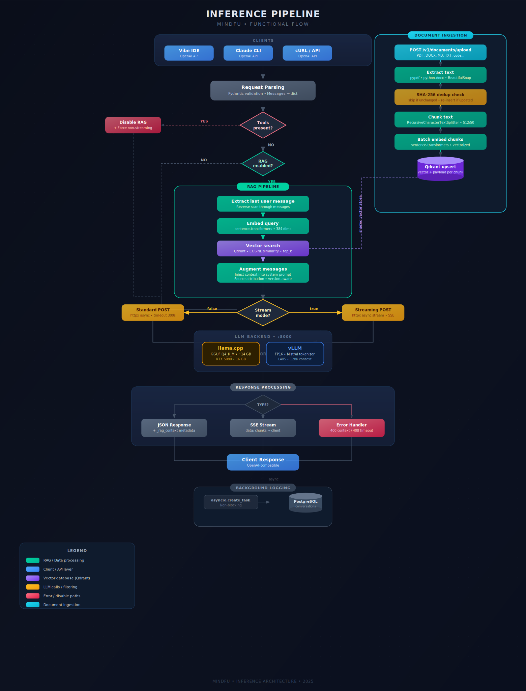
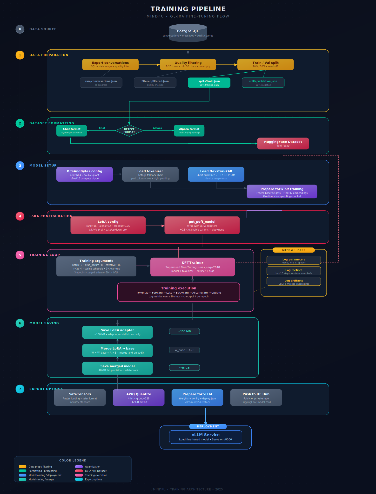

# MindFu

Local LLM system with RAG capabilities, training pipeline, and OpenAI-compatible API.

## Quick Start

```bash
# 1. Setup
./scripts/setup.sh

# 2. Download model
./scripts/download-model.sh

# 3. Start services
docker compose up -d

# 4. Verify
curl http://localhost:8080/health
```

## Architecture

### Inference Pipeline

Client requests flow through the RAG service, which augments prompts with relevant context from Qdrant before forwarding to the LLM backend (llama.cpp or vLLM).

<p align="center">
  <a href="docs/inference-flow.svg">
    
  </a>
</p>

### Training Pipeline

Conversations are exported from PostgreSQL, filtered, formatted, then used to QLoRA fine-tune Devstral-24B with 4-bit quantization. Experiments are tracked in MLflow.

<p align="center">
  <a href="docs/training-flow.svg">
    
  </a>
</p>

## Endpoints

| Service | URL | Description |
|---------|-----|-------------|
| RAG API | http://localhost:8080 | OpenAI-compatible API with RAG |
| LLM Direct | http://localhost:8000 | Direct vLLM access (no RAG) |
| Qdrant | http://localhost:6333 | Vector database |
| MLflow | http://localhost:5000 | Experiment tracking |

## Usage

### Chat Completion (with RAG)

```bash
curl http://localhost:8080/v1/chat/completions \
  -H "Content-Type: application/json" \
  -d '{
    "model": "devstral-small-2",
    "messages": [{"role": "user", "content": "Hello"}]
  }'
```

### Upload Documents

```bash
# Upload a file
curl -X POST http://localhost:8080/v1/documents/upload \
  -F "file=@document.pdf"

# Upload text
curl -X POST http://localhost:8080/v1/documents \
  -H "Content-Type: application/json" \
  -d '{
    "content": "Your document content here",
    "metadata": {"source": "manual"}
  }'
```

### Configure Claude CLI

Add to your Claude config:
```json
{
  "api_base_url": "http://localhost:8080/v1"
}
```

## Training

Start the training service:

```bash
docker compose --profile training up training
```

## Hardware Requirements

- GPU: NVIDIA RTX 5080 (16GB VRAM)
- RAM: 32GB
- Storage: ~50GB for models and data

## Files

```
mindfu/
├── docker-compose.yml      # Main orchestration
├── .env                    # Configuration
├── services/
│   ├── llm/               # vLLM inference
│   ├── rag/               # RAG service
│   └── training/          # Fine-tuning
├── data/
│   ├── documents/         # RAG source documents
│   ├── conversations/     # Logs for training
│   └── models/            # Fine-tuned models
└── scripts/
    ├── setup.sh           # Initial setup
    ├── download-model.sh  # Download base model
    └── backup.sh          # Backup data
```
